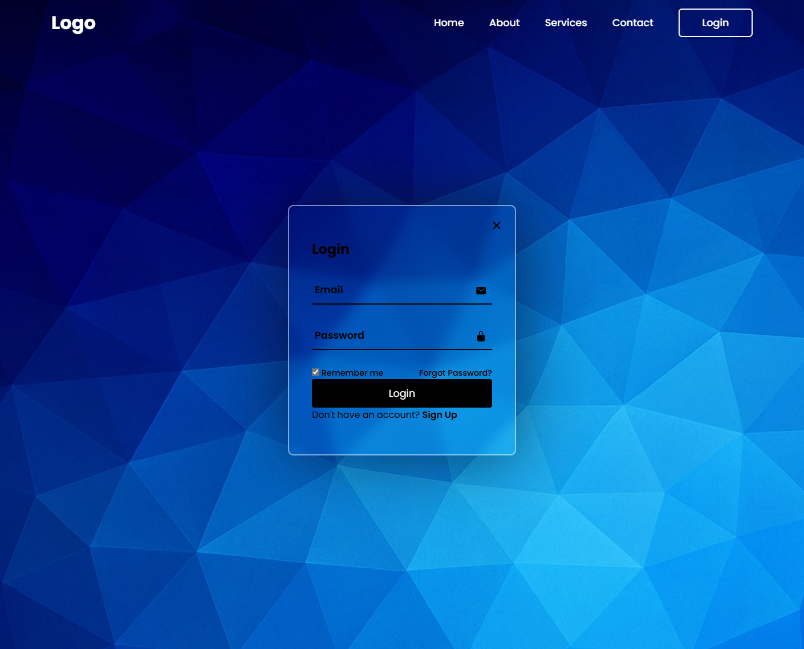

# Login & Registration Website

Ein modernes, responsives Login- und Registrierungs-Frontend mit animiertem Popup-Design, erstellt mit **HTML**, **CSS** und **JavaScript**.  
Das Projekt nutzt **Ionicons** für Icons und **Google Fonts (Poppins)** für ein cleanes, modernes Erscheinungsbild.

---

##  Features

-  **Popup-Login & -Registrierung** mit sanfter Animation  
-  **Glassmorphism-Design** mit Blur-Effekt  
-  **Responsives Layout** (funktioniert auch auf Mobilgeräten)  
-  **Ionicons-Integration** für stilvolle Icons  
-  **Dynamischer Hintergrund** mit anpassbarem Bild  
-  **Klares, modular aufgebautes Script (`script.js`)** mit Debug-Ausgaben  

---

## 📁 Projektstruktur

```
webseite/
│
├── .idea/                     # Projektkonfiguration (IDE)
│
├── images/
│   └── Background_new.jpg     # Hintergrundbild
│
├── index.html                 # Hauptseite
├── style.css                  # Styling
├── script.js                  # Interaktive Logik
├── package.json               # Optional (z. B. für lokale Server)
└── README.md                  # Dieses Dokument
```

---

##  Vorschau



---

##  Funktionsweise

Das Popup wird durch Klick auf den **Login-Button in der Navigation** geöffnet.  
- Mit "Sign Up" kannst du zur Registrierungsansicht wechseln.  
- Das **X**-Icon schließt das Popup.  
- JavaScript regelt alle Zustände über Klassen (`active` / `active-popup`).

Die wichtigsten Klassen:
- `.wrapper.active-popup` → Popup sichtbar  
- `.wrapper.active` → Registrierungsformular aktiv  

---

## 🛠️ Technologien

| Kategorie | Technologie |
|------------|--------------|
| Frontend   | HTML5, CSS3, JavaScript |
| Icons      | [Ionicons](https://ionic.io/ionicons) |
| Fonts      | [Google Fonts – Poppins](https://fonts.google.com/specimen/Poppins) |
| Tools      | VS Code / JetBrains WebStorm |

---

## ⚙️ Lokale Ausführung

1. Repository klonen:
   ```bash
   git clone https://github.com/<dein-benutzername>/<dein-repo>.git
   ```
2. In Projektordner wechseln:
   ```bash
   cd webseite
   ```
3. Lokalen Server starten (z. B. mit Python oder Node):
   ```bash
   # Mit Python
   python -m http.server 8000
   ```
   oder
   ```bash
   # Mit Node
   npx http-server
   ```
4. Öffne im Browser:
   ```
   http://localhost:8000
   ```

---

##  Anpassung

Du kannst folgende Elemente leicht anpassen:
- Hintergrundbild (`/images/Background_new.jpg`)
- Farben & Schriftgrößen in `style.css`
- Texte & Logos in `index.html`

---

##  Lizenz

Dieses Projekt steht zur freie Nutzung.


---

## 🤝 Mitwirken

Pull Requests sind willkommen!  
Falls du Ideen, Fehler oder Verbesserungsvorschläge hast, öffne einfach ein Issue oder sende einen PR.  

---

Erstellt mit ❤️ von **Timo**

